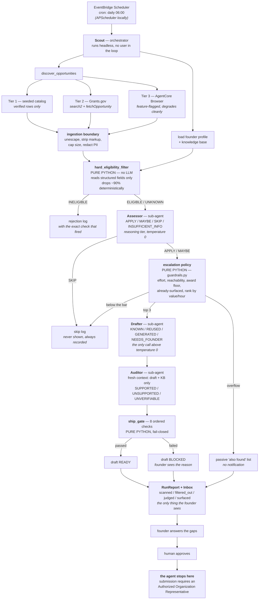
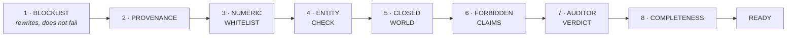
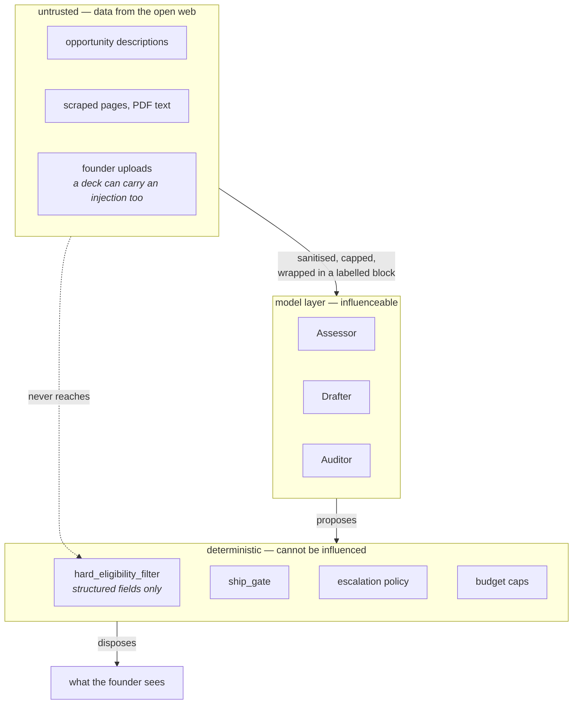

# Architecture

Diagram source is committed, not just a PNG. Render with any Mermaid tool.

## The run

## The ship gate

Ordered. First failure stops the chain. An exception anywhere inside is
reported as `GATE_EXCEPTION` and the draft is `BLOCKED` — a throw in the
safety layer is never read as a pass.

## Trust boundaries

The thing worth understanding about this system is which layers can be
talked out of their answer and which cannot.

A fully successful prompt injection inside an opportunity description can
make the Assessor say anything it likes. It still cannot change a Python
comparison against a structured field, it cannot spend past the token
ceiling, it cannot get an ungrounded number through the gate, and it cannot
cause a second notification about the same opportunity. That is the design.

## Sub-agents

Three agents, three different failure modes. This is why they are separate
rather than one agent with a longer prompt.

| Sub-agent | Model tier | Temperature | Sees | Fails by |
|---|---|---|---|---|
| Assessor | reasoning | 0 | one opportunity, the profile, the filter's structured output | judging fit badly |
| Drafter | reasoning | > 0 | the form, the knowledge base, the opportunity | inventing facts |
| Auditor | reasoning | 0 | the finished draft and the knowledge base — **nothing else** | missing an invention |

The Auditor's isolation is the point. It never sees the Drafter's prompt, its
reasoning, or its provenance claims, because an auditor that inherits the
drafter's context inherits its mistakes. When they disagree, the Drafter
loses and the field goes back to the founder.
