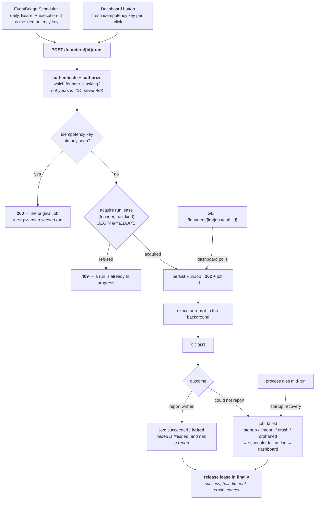
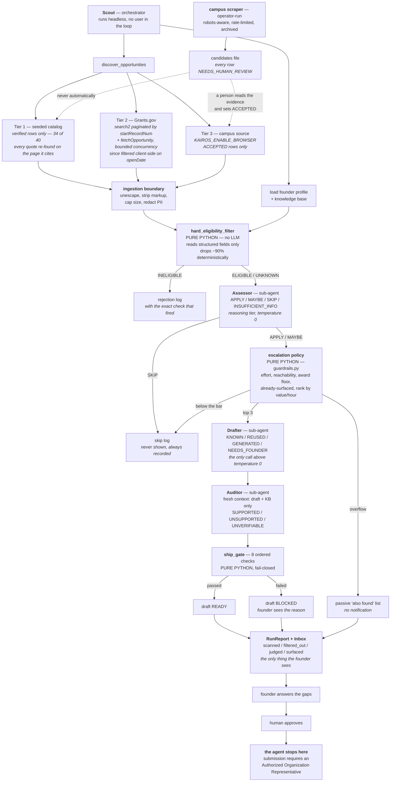
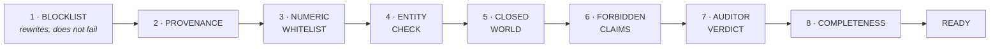
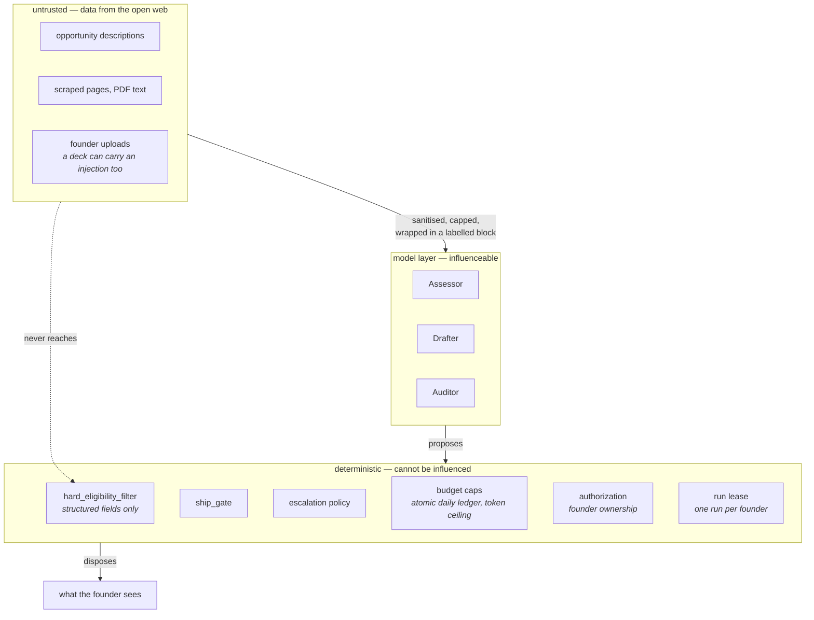

# Architecture

Diagram source is committed, not just a PNG. Render with any Mermaid tool.

## Getting into a run

A run takes minutes, so no HTTP request waits for one. Both entry points —
the scheduler and the dashboard button — hit the same endpoint, which
persists a job and returns immediately. The lease is what makes "the same
endpoint" safe.



Two properties this diagram exists to make obvious:

- **Nothing reaches Scout without holding the lease**, so two runs for one
  founder cannot overlap however they were triggered.
- **The lease is released in a `finally`**, and a crash that skips even that
  is repaired at startup — no job stays `running` with no process behind it,
  and the lease expires on its own TTL.

## The run



## The ship gate

Ordered. First failure stops the chain. An exception anywhere inside is
reported as `GATE_EXCEPTION` and the draft is `BLOCKED` — a throw in the
safety layer is never read as a pass.



## Trust boundaries

The thing worth understanding about this system is which layers can be
talked out of their answer and which cannot.



A fully successful prompt injection inside an opportunity description can
make the Assessor say anything it likes. It still cannot change a Python
comparison against a structured field, it cannot spend past the token
ceiling, it cannot get an ungrounded number through the gate, it cannot
cause a second notification about the same opportunity, it cannot start a
second concurrent run, and it cannot reach another founder's data. That is
the design.

Every one of those is a database constraint or a Python comparison, not a
prompt: the unique index on the inbox idempotency key, the `BEGIN IMMEDIATE`
on the lease and the spend ledger, the ownership check on every
founder-scoped route. A model cannot argue with an index.

## Sub-agents

Three agents, three different failure modes. This is why they are separate
rather than one agent with a longer prompt.

| Sub-agent | Model tier | Temperature | Sees | Fails by |
|---|---|---|---|---|
| Assessor | reasoning | 0 | one opportunity, the profile, the filter's structured output | judging fit badly |
| Drafter | reasoning | > 0 | the form, the knowledge base, the opportunity | inventing facts |
| Auditor | reasoning | 0 | the finished draft and the knowledge base — **nothing else** | missing an invention |

The Auditor's isolation is the point. It never sees the Drafter's prompt, its
reasoning, or its provenance claims, because an auditor that inherits the
drafter's context inherits its mistakes. When they disagree, the Drafter
loses and the field goes back to the founder.

## The curation boundary

Discovery has two halves that must not touch, and the diagram above draws the
gap deliberately. Everything below the dotted line is research; everything
above it is what a founder can be told about.

```
      research                        │            runtime
                                      │
  campus scraper ──► candidates file  │
  (robots, rate limit, archive)       │
                          │           │
              a person reads evidence │
              and sets ACCEPTED ──────┼──► CampusDiscoverySource
                                      │    (KAIROS_ENABLE_BROWSER)
  research sweeps ──► batch files     │
                          │           │
       merge_candidates.py (validate, │
       dedupe, refuse unreachable)    │
                          │           │
                 candidates.json      │
                          │           │
        verify_seed.py (refetch page, │
        re-find every quote where it  │
        claims to come from) ─────────┼──► SeedCatalog
                                      │    (verified rows only)
```

Three properties hold across that line:

1.  **Nothing crosses automatically.** No code path writes
    `opportunities.seed.json` from a scrape, and no scraped row becomes an
    opportunity without a human setting `ACCEPTED`.
2.  **A quote is checked where it claims to come from.** Programs state
    eligibility on FAQ and rules sub-pages, so the verifier follows
    `source_doc` rather than assuming the landing page, and refuses evidence
    citing another organisation's site.
3.  **Re-checking reports; it does not curate.** `reverify.py` writes a diff
    of what moved — dead pages, redirects, expired deadlines, lost evidence —
    and edits nothing. Automatic correction of a curated fact is the same
    failure as automatic promotion, one step later.

## Measurement

Two evals, deliberately unrelated, because they answer different questions
and a single number would hide both.

| Eval | Question | Ground truth | Current result |
|---|---|---|---|
| Discovery benchmark | Did we find the money? | 20 hand-authored programs, read off their own pages, 6 deliberate negatives | 85.7% retrieval recall; eligibility 72.2% coverage at 100% precision; 0 wrong deadlines |
| Section 11.11 golden set | Did we lie on the application? | Per-field truth declared by hand | published in the README, fixture-based |

Neither derives its answers from the code it scores. The discovery
benchmark's reference keys are asserted not to be a subset of the catalog's
own ids; the golden-set scorer imports nothing from `guardrails`. A scorer
that asks the system whether the system was right is marking its own
homework.
